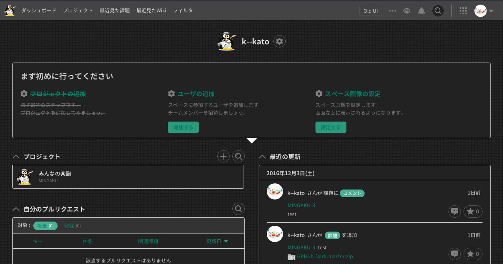

# The Dark Side of Backlog

## Installing

* If using Stylish:
  * Get the Stylish addon for [Firefox](https://addons.mozilla.org/en-US/firefox/addon/2108/), [Chrome](https://chrome.google.com/extensions/detail/fjnbnpbmkenffdnngjfgmeleoegfcffe), [Opera](https://addons.opera.com/en/extensions/details/stylish/), [Safari](http://sobolev.us/stylish/) and [Firefox Mobile](https://addons.mozilla.org/en-US/firefox/addon/2108/).
  * Then install this style using:
    * [userstyles.org](https://userstyles.org/styles/136005/backlog-dark)
    * or, add it [manually](https://github.com/k--kato/BacklogDark/blob/master/dest/css/backlog-dark.css) into the editor.

## References

1. GitHub, GitHub-Dark, https://github.com/StylishThemes/GitHub-Dark
1. PostCSS, PostCSS CSS Variables, https://github.com/MadLittleMods/postcss-css-variables
